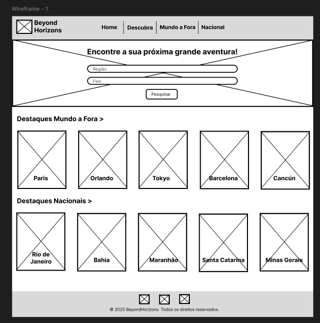
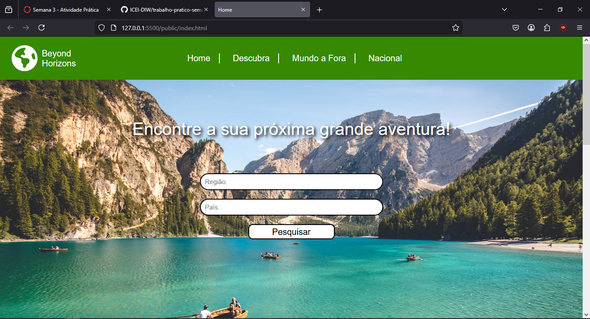

# Trabalho Prático - Semana 03

Dessa vez, vamos escolher uma proposta de projeto para trabalhar. Na [lista de propostas de projetos](propostas-projetos.md), escolha um dentre as alternativas.

Nessa atividade, você deverá montar a página inicial do projeto escolhido, a organização do HTML aplicando semântica correta e uso aprimorado do CSS. Leia o enunciado completo no Canvas para mais detalhes.

**IMPORTANTE:** Você deve trabalhar e alterar apenas arquivos dentro da pasta **`public`**. Deixe todos os demais arquivos e pastas desse repositório inalterados. **PRESTE MUITA ATENÇÃO NISSO.**

## Informações Gerais

- Nome: Pedro Carvalho Mattar
- Matricula: 888302
- Proposta de projeto escolhida: Guia de Lugares Turísticos
- Breve descrição sobre seu projeto: Uma página Web para ajudar na hora de viajar. Com as regiões do mundo e seus países, acompanhados de seus principais pontos turisticos. Além dos principais lugares e regiões brasileiras e suas principais atrações. Cada lugar e atrações com informações e localização, além de imagens ilustrativas dos pontos turisticos.

## Print do esboço criada

## Print da home-page criada

