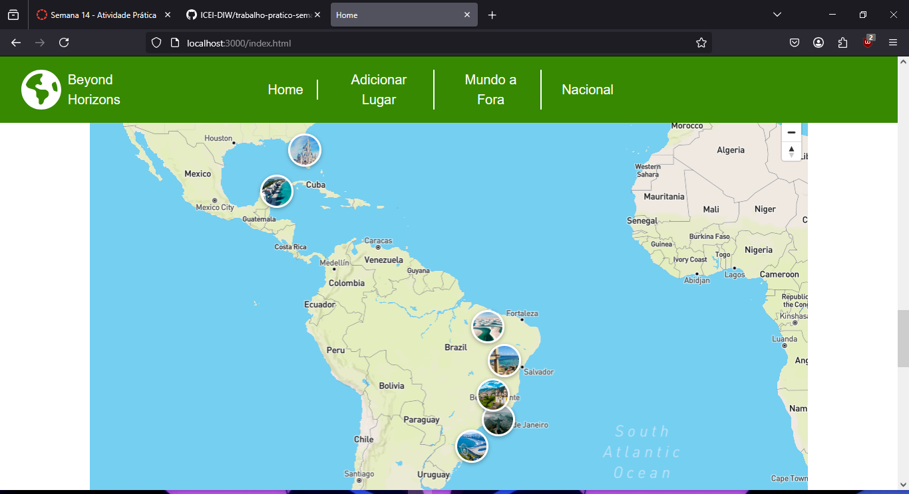
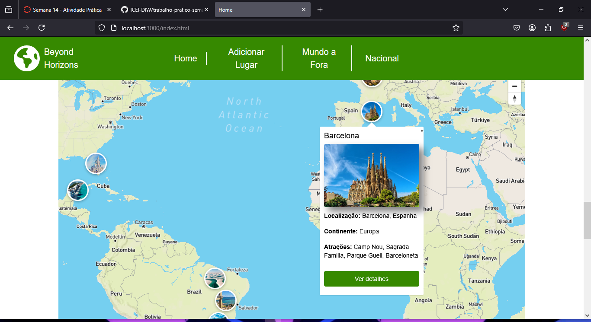

# Trabalho Prático - Semana 14

A partir dos dados cadastrados na etapa anterior, vamos trabalhar formas de apresentação que representem de forma clara e interativa as informações do seu projeto. Você poderá usar gráficos (barra, linha, pizza), mapas, calendários ou outras formas de visualização. Seu desafio é entregar uma página Web que organize, processe e exiba os dados de forma compreensível e esteticamente agradável.

Com base nos tipos de projetos escohidos, você deve propor **visualizações que estimulem a interpretação, agrupamento e exibição criativa dos dados**, trabalhando tanto a lógica quanto o design da aplicação.

Sugerimos o uso das seguintes ferramentas acessíveis: [FullCalendar](https://fullcalendar.io/), [Chart.js](https://www.chartjs.org/), [Mapbox](https://docs.mapbox.com/api/), para citar algumas.

## Informações do trabalho

- Nome: Pedro Carvalho Mattar
- Matricula: 888302
- Proposta de projeto escolhida: Guia de Lugares Turísticos
- Breve descrição sobre seu projeto: Uma página Web para ajudar na hora de viajar. Com as regiões do mundo e seus países, acompanhados de seus principais pontos turisticos. Além dos principais lugares e regiões brasileiras e suas principais atrações. Cada lugar e atrações com informações e localização, além de imagens ilustrativas dos pontos turisticos.

**Print da tela com a implementação**

Mapa dinâmico, com marcadores que mostram a localização dos lugares no mundo, juntamente de pequenas informações sobre os lugares, e acesso para a página de mais detalhes de cada lugar.

